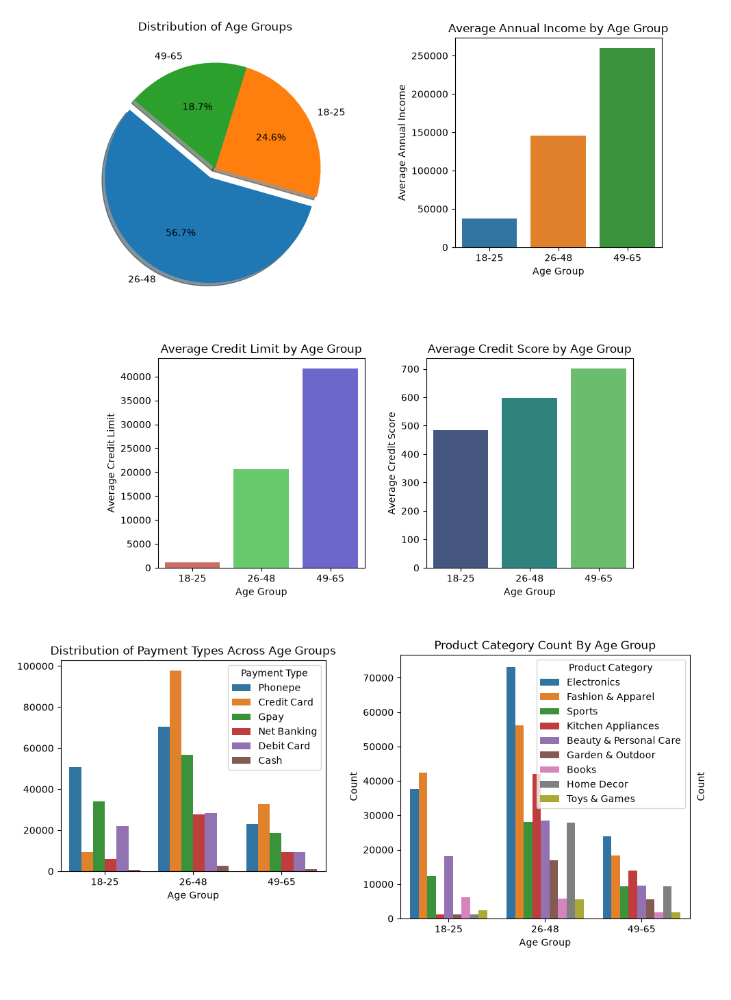
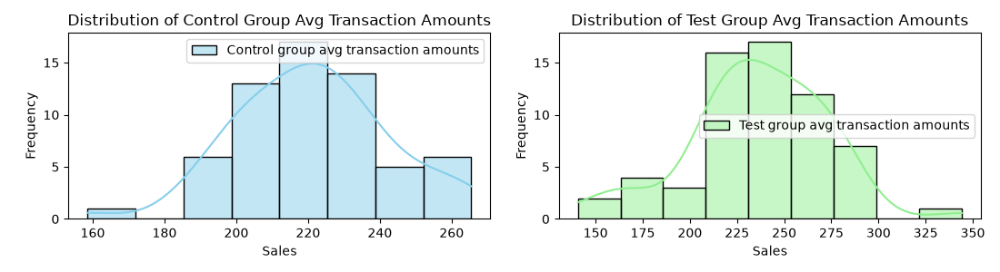

# AtliQo Bank Credit Card Project

## Problem Statement

AtliQo Bank wants to launch a new credit card and identify an untapped customer segment that could drive higher transaction activity. The project analyzes customer demographics, credit profiles, and transaction behaviour to identify a suitable target market. An A/B test is then used to evaluate whether the new credit card can increase average transaction amounts among the selected customers.

## Project Objective

To identify an untapped customer segment for AtliQo Bank's new credit card and evaluate whether the card increases average transaction amounts through an A/B testing campaign.

## Project Overview

This project is divided into two phases:

- **Phase 1:** Customer, credit profile, and transaction analysis to identify the most suitable target market.
- **Phase 2:** A/B testing to evaluate the impact of the new credit card on average transaction amounts.

---

## Phase 1 — Customer & Market Analysis

The first phase focuses on cleaning and analyzing customer, credit profile, and transaction data.

The analysis covered:

- Customer demographics and age distribution
- Annual income and occupation-wise income patterns
- Credit scores, credit limits, and outstanding debt
- Payment methods and transaction behaviour
- Transaction categories and shopping preferences
- Differences in financial and transaction behaviour across age groups

### Target Market Selection

The analysis identified the **18–25 age group** as an untapped market based on its financial profile and transaction behaviour.

Key observations:

- The 18–25 age group represents **25% of the customer base**.
- Average annual income for this group is below **50,000**.
- The group has relatively limited credit history, reflected in lower credit scores and credit limits.
- Credit-card usage is relatively low compared with other age groups.
- The segment shows clear spending activity across categories such as **Electronics, Fashion & Apparel, and Beauty & Personal Care**.

These findings led to the selection of the **18–25 age group** for the trial credit-card campaign.

---

## Phase 2 — A/B Testing & Campaign Analysis

The second phase evaluates whether the newly launched credit card can increase average transaction amounts.

### Pre-Campaign

- Statistical power and effect size were used to determine the required sample size.
- With a significance level of **5%**, statistical power of **80%**, and an effect size of **0.4**, **100 customers** were selected for the test group.
- The campaign was designed as a **two-month trial**.
- The campaign achieved a **40% conversion rate**, resulting in 40 customers using the new credit card.
- A separate control group of 40 customers was used for comparison.

### Post-Campaign Analysis

For each of the 40 customers in the control and test groups, their daily average transaction amount was tracked during the 2-month campaign.

The main question this test was designed to answer was:

> **Did the new credit card increase the average transaction amount?**

Before running the statistical test, the transaction amounts of the two groups were compared to see how they were spread out.

### Hypothesis Testing

A **one-sided two-sample Z-test** was performed to determine whether the average transaction amount of the test group was significantly higher than that of the control group.

### A/B Test Result

| Metric | Value |
|---|---|
| Control group mean | 221.18 |
| Test group mean | 235.98 |
| Z-statistic | 2.75 |
| p-value | 0.0030 |
| Significance level (α) | 0.05 |
| Conclusion | Reject the null hypothesis |

Since the p-value is below 0.05 and the Z-statistic exceeds the critical Z-value of approximately 1.645, the null hypothesis is rejected.

**Conclusion:** The test results provide statistically significant evidence that the newly launched credit card increased the average transaction amount compared with the control group.

---

## Tools & Libraries Used

- **Python** – Core programming language
- **Pandas** – Data cleaning, transformation, and analysis
- **NumPy** – Numerical computations
- **Matplotlib** – Data visualization
- **Seaborn** – Statistical data visualization
- **SciPy** – Statistical analysis and hypothesis testing
- **Statsmodels** – A/B testing and statistical inference
- **Jupyter Notebook** – Interactive analysis and documentation

## Acknowledgements

This project was completed as part of the Codebasics Data Science Bootcamp. The datasets used in this project were provided by Codebasics for educational purposes and are not included in this repository due to distribution restrictions.

## Author

**Muhammad Arif Bhatti**

This project was developed as part of my Data Science learning journey.

- GitHub: https://github.com/arifbhatti-py
- LinkedIn: https://linkedin.com/in/arifbhatti